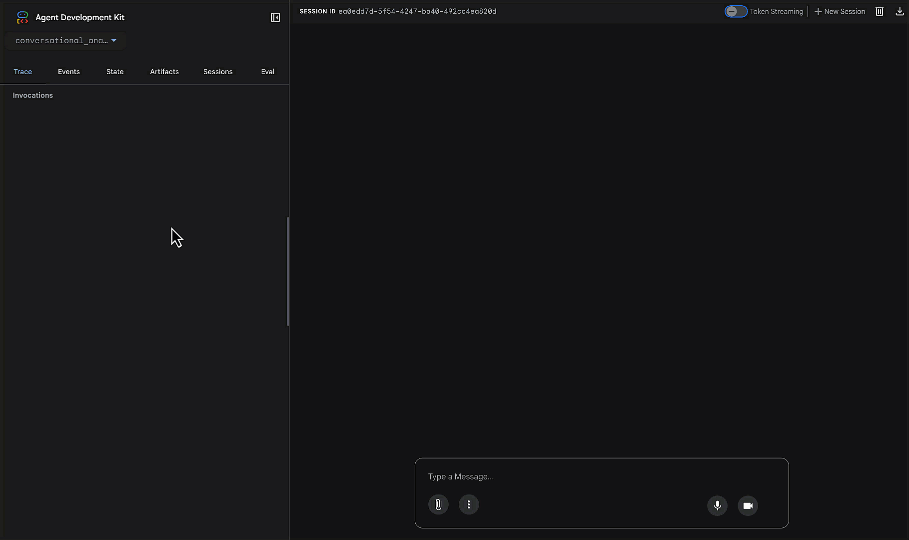

# Conversational Analytics API Demo

This project demonstrates how to interact with a Conversational Analytics API using a stateless chat approach. It includes the necessary setup steps to get you started.

## Prerequisites

1.  **Google Cloud Project:** You need a Google Cloud project with the Vertex AI API enabled and [Gemini Data Analytics API enabled](https://cloud.google.com/gemini/docs/conversational-analytics-api/enable-the-api)
2.  **Vertex AI Code Interpreter Extension:** Ensure you have created and configured a Vertex AI Code Interpreter Extension within your Google Cloud project - follow this [Documentation](https://cloud.google.com/vertex-ai/generative-ai/docs/extensions/create-extension)
3.  **Python 3.7+:** Make sure you have a compatible Python version installed.
4.  **Looker Instance:** An existing Looker instance with a LookML model and explore to query.
5.  **Looker API Keys:** Follow [these steps](https://cloud.google.com/looker/docs/admin-panel-users-users#api_keys) to obtain Looker API keys

## Setup Instructions

1.  **Clone the Repository:**
    ```bash
    git clone <your-repository-url>
    cd ca-api-adk
    ```

2.  **Create a Virtual Environment:**
    It's recommended to use a virtual environment to manage dependencies.
    ```bash
    python -m venv myenv
    ```

3.  **Activate the Virtual Environment:**
    ```bash
    source myenv/bin/activate
    ```
    (On Windows, use `myenv\Scripts\activate`)

4.  **Install Requirements:**
    Install the necessary Python packages.
    ```bash
    pip install -r requirements.txt
    ```

5.  **Configure Environment Variables:**
    Copy the example environment file and add your specific configuration.
    ```bash
    cp conversational_analytics_api/.env_example conversational_analytics_api/.env
    ```
    Edit `conversational_analytics_api/.env` and fill in the required values.

    ```bash
    # Config for ADK
    GOOGLE_CLOUD_PROJECT=""
    GOOGLE_CLOUD_LOCATION="" #e.g. us-central1
    GOOGLE_GENAI_USE_VERTEXAI="True"

    # Config for Agent
    GEMINI_MODEL = "gemini-2.5-flash"
    VERTEX_AI_CODE_INTERPRETER_EXTENSION = 
    LOOKER_CLIENT_ID = 
    LOOKER_CLIENT_SECRET = 
    LOOKER_INSTANCE_URI = 
    LOOKML_MODEL = 
    LOOKER_EXPLORE = 
    CA_API_SYSTEM_INSTRUCTIONS = E.g: "You are an expert sales, product, and operations analyst for our e-commerce store. Your primary function is to answer questions by querying the 'Order Items' Explore. Always be concise and data-driven. Never generate a chart."
    CA_API_BILLING_PROJECT =
    ```


## Running the Demo

1.  **Run ADK Web UI to test:**
    ```bash
    adk web
    ```



## Deploy Agent

- Follow this guide: https://google.github.io/adk-docs/deploy/agent-engine/ to deploy agent to Vertex AI Agent Engine and potentially use with Agentspace.
- Follow this guide: https://google.github.io/adk-docs/deploy/cloud-run/ to deploy agent to Cloud Run.
- Follow this guide: https://google.github.io/adk-docs/deploy/gke/ to deploy agent to Google Kubernetes Engine (GKE).