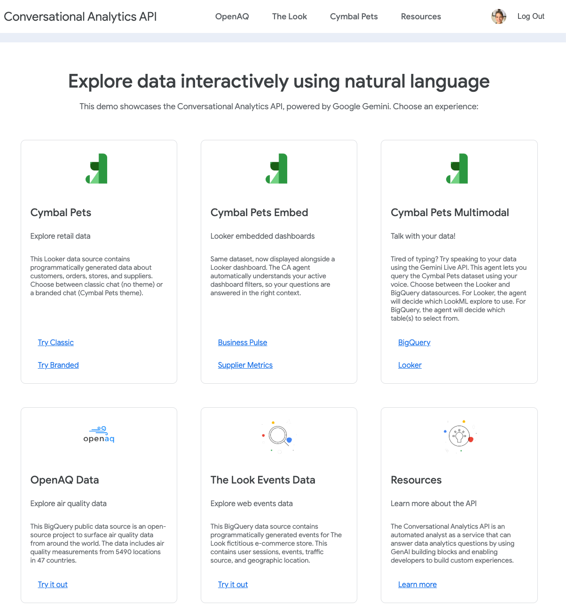

**This is not an officially supported Google product. This project is not eligible for the [Google Open Source Software Vulnerability Rewards Program](https://bughunters.google.com/open-source-security).**

**This project is intended for demonstration purposes only. It is not intended for use in a production environment.**

# Conversational Analytics API Golden Demo

The Conversational Analytics API provides a natural language interface to query Looker and BigQuery data programmatically. This demo provides various examples to integrate the CA API into web applications: querying the Agent directly, alongside an embedded Looker dashboard, and even using the Gemini Live API for a multimodal conversation.

This is the application that powered the [Data and Analytics Spotlight Keynote Demo](https://youtu.be/-Uda0ldaVbA?si=_GDgWm5tEo9MX9sX&t=1489) at Google NEXT.



## Development

1. Set Node version

   - Open terminal: `nvm use v22`

1. Install Dependencies:

   - In the root directory: `npm install`
   - In the client directory: `npm install`

1. Create a GCP project and ensure you're logged in to the correct project:

   - `gcloud auth login`
   - `gcloud auth application-default login`
   - `gcloud auth application-default set-quota-project YOUR_PROJECT_ID`

1. Enable GCP APIs:

   ```
   gcloud services enable \
   aiplatform.googleapis.com \
   appengine.googleapis.com \
   artifactregistry.googleapis.com \
   bigquery.googleapis.com \
   cloudaicompanion.googleapis.com \
   dataform.googleapis.com \
   dataqna.googleapis.com \
   firebase.googleapis.com \
   logging.googleapis.com \
   monitoring.googleapis.com \
   secretmanager.googleapis.com \
   serviceusage.googleapis.com \
   storage-component.googleapis.com
   ```

1. Set up Firebase:

   - This app uses Firebase for user authentication, so that only users logged in to your GCP org can access

   - Go to the [Firebase console](https://console.firebase.google.com)

   - Select 'Create a Firebase project' → Choose the 'Add Firebase to Google Cloud project' option → select your GCP project

   - In Project Settings (the gear icon) → General → scroll to Your apps

   - Select web app → Register app with nickname

   - Copy the generated `firebaseConfig` variables to save in `client/.env` and `client/.env.production`. Make sure to switch from camelCase to all caps so your files should look like this:

   - `client/.env`:

     ```
     # Firebase
     REACT_APP_FIREBASE_API_KEY=xxx
     REACT_APP_FIREBASE_AUTH_DOMAIN=xxx
     REACT_APP_FIREBASE_PROJECT_ID=xxx
     REACT_APP_FIREBASE_STORAGE_BUCKET=xxx
     REACT_APP_FIREBASE_MESSAGING_SENDER_ID=xxx
     REACT_APP_FIREBASE_APP_ID=xxx

     # update with your Looker URI
     REACT_APP_LOOKER_INSTANCE_URI=https://looker.abc.com

     # update with your embed Looker Studio Report URI (access through hidden route /studio-embed [OPTIONAL])
     REACT_APP_LOOKER_STUDIO_REPORT=https://looker.abc.com/embed/reporting/abc123

     # websocket url with port for development
     REACT_APP_WS_MULTIMODAL_LIVE_URL=ws://localhost:8081/ws/multimodal
     ```

   - `client/.env.production`:

     ```
     # Firebase
     REACT_APP_FIREBASE_API_KEY=xxx
     REACT_APP_FIREBASE_AUTH_DOMAIN=xxx
     REACT_APP_FIREBASE_PROJECT_ID=xxx
     REACT_APP_FIREBASE_STORAGE_BUCKET=xxx
     REACT_APP_FIREBASE_MESSAGING_SENDER_ID=xxx
     REACT_APP_FIREBASE_APP_ID=xxx

     # update with your Looker URI
     REACT_APP_LOOKER_INSTANCE_URI=https://looker.abc.com

     # update with your embed Looker Studio Report URI (access through hidden route /studio-embed [OPTIONAL])
     REACT_APP_LOOKER_STUDIO_REPORT=https://looker.abc.com/embed/reporting/abc123
     ```

   - In the console sidebar → Authentication → Get Started → Sign-in method. Enable the Google provider

   - Still under Authentication → Settings (top-right gear) → Authorized domains. localhost is there by default for local development, but you will need to Add the domain of the App Engine deploy URL. This will be `PROJECT_ID.REGION_ID.r.appspot.com`

1. Setup `.env` in root folder:

   - You will need to have API credentials from a Looker instance. We recommend using an [API-only service account](https://cloud.google.com/looker/docs/looker-core-user-management#creating_an_api-only_service_account) with `develop` permission as a minimum requirement

   - For access to the LookML model, fork the [cymbal-pets-lookml](https://github.com/llooker/cymbal-pets-lookml) repo. Create a new LookML project on your instance and connect to Git

     ```
     GCP_PROJECT_NAME=xxx
     LOOKER_INSTANCE_URI=https://looker.abc.com
     LOOKER_CLIENT_ID=xxx
     LOOKER_CLIENT_SECRET=xxx
     LOOKER_EMBED_DOMAIN=http://localhost:3000 # for development
     ```

1. Development (Local):

   - In the root directory: `npm run dev`. This will start both the backend and frontend development servers concurrently
   - Your React app will be available at http://localhost:3000, and it will proxy API requests to the server at http://localhost:8081

   This should load up the application locally but you will get errors trying to run queries as you will need to set the env variables and GCP secrets

1. Set up the secrets in Secret Manager (see [table](#secrets))

   - Keeping the system instructions separated in secrets will allow you to quickly update agent instructions without requiring a full app deployment every time when tweaking the prompts

   - In the `secrets/` folder, update the `ALLOWLIST_CORTADO_MULTIMODAL.txt` with a list of emails you wish to restrict access to the multimodal page (The Vertex Live API is currently limited to 3 concurrent sessions which can cause issues if too many users are accessing the page at the same time). If this is not required, comment out the `checkAllowlist` function and just replace with `setAllowed(true)` in [AllowlistWraper](/client/src/AllowlistWrapper.tsx)

   - Update `LOOKER_CLIENT_ID.txt` and `LOOKER_CLIENT_SECRET.txt` with Looker API credentials

   - Run the `import-secrets.sh` script, e.g. `./secrets/import-secrets.sh PROJECT_ID ./secrets`

   **If you just want to develop and run the app locally you can stop here. The next steps are only required for deployment.**

1. Test a build:

   - In the root directory: `npm run build` This creates a production build of the React app in `client/build`

1. Update `app.yaml`:

   - Update the variables in `app.yaml`:

     ```
     GCP_PROJECT_NAME: PROJECT_ID
     LOOKER_INSTANCE_URI: https://looker.abc.com
     LOOKER_EMBED_DOMAIN: https://PROJECT_ID.REGION_ID.r.appspot.com # for cymbalpets_embed page
     ```

   - Make sure to add your App Engine deploy URL to the [Embedded Domain Allowlist](https://cloud.google.com/looker/docs/admin-panel-platform-embed#embedded_domain_allowlist)

1. Deployment:

   - In the root directory: `gcloud app deploy`. Select a region and before you deploy, double check the target url matches the domain you entered on Firebase Authorized domains and the LOOKER_EMBED_DOMAIN on the `app.yaml` file

   - If you get this error `ERROR: (gcloud.app.deploy) Error Response: [13] An internal error occurred.`, grant the below roles to the App Engine default service account and try again

   - If the build hangs on this line `Updating service [default] (this may take several minutes)...`, check Logs Explorer for any errors on the project. You may need to modify some organization policies on the project

1. Grant access to App Engine default service account (replace YOUR_PROJECT_ID in the below commands):

   ```
   # Artifact Registry Reader
   gcloud projects add-iam-policy-binding YOUR_PROJECT_ID --member="serviceAccount:YOUR_PROJECT_ID@appspot.gserviceaccount.com" --role="roles/artifactregistry.reader"

   # BigQuery Studio User
   gcloud projects add-iam-policy-binding YOUR_PROJECT_ID --member="serviceAccount:YOUR_PROJECT_ID@appspot.gserviceaccount.com" --role="roles/bigquery.studioUser"

   # BigQuery User
   gcloud projects add-iam-policy-binding YOUR_PROJECT_ID --member="serviceAccount:YOUR_PROJECT_ID@appspot.gserviceaccount.com" --role="roles/bigquery.user"

   # Gemini for Google Cloud User
   gcloud projects add-iam-policy-binding YOUR_PROJECT_ID --member="serviceAccount:YOUR_PROJECT_ID@appspot.gserviceaccount.com" --role="roles/cloudaicompanion.user"

   # Logs Writer
   gcloud projects add-iam-policy-binding YOUR_PROJECT_ID --member="serviceAccount:YOUR_PROJECT_ID@appspot.gserviceaccount.com" --role="roles/logging.logWriter"

   # Monitoring Metric Writer
   gcloud projects add-iam-policy-binding YOUR_PROJECT_ID --member="serviceAccount:YOUR_PROJECT_ID@appspot.gserviceaccount.com" --role="roles/monitoring.metricWriter"

   # Secret Manager Secret Accessor
   gcloud projects add-iam-policy-binding YOUR_PROJECT_ID --member="serviceAccount:YOUR_PROJECT_ID@appspot.gserviceaccount.com" --role="roles/secretmanager.secretAccessor"

   # Service Account User
   gcloud projects add-iam-policy-binding YOUR_PROJECT_ID --member="serviceAccount:YOUR_PROJECT_ID@appspot.gserviceaccount.com" --role="roles/iam.serviceAccountUser"

   # Service Usage Viewer
   gcloud projects add-iam-policy-binding YOUR_PROJECT_ID --member="serviceAccount:YOUR_PROJECT_ID@appspot.gserviceaccount.com" --role="roles/serviceusage.serviceUsageViewer"

   # Storage Object Creator
   gcloud projects add-iam-policy-binding YOUR_PROJECT_ID --member="serviceAccount:YOUR_PROJECT_ID@appspot.gserviceaccount.com" --role="roles/storage.objectCreator"

   # Storage Object Viewer
   gcloud projects add-iam-policy-binding YOUR_PROJECT_ID --member="serviceAccount:YOUR_PROJECT_ID@appspot.gserviceaccount.com" --role="roles/storage.objectViewer"

   # Vertex AI User
   gcloud projects add-iam-policy-binding YOUR_PROJECT_ID --member="serviceAccount:YOUR_PROJECT_ID@appspot.gserviceaccount.com" --role="roles/aiplatform.user"

   # Cloud Build Service Account
   gcloud projects add-iam-policy-binding YOUR_PROJECT_ID --member="serviceAccount:YOUR_PROJECT_ID@appspot.gserviceaccount.com" --role="roles/cloudbuild.builds.builder"
   ```

## Project Structure

```
dataqna-golden-demo/
├── server/ # Backend code (Node.js)
│ └── authHelper.ts # GCP access token
│ └── index.ts # Backend entry point
│ └── config.ts # Configuration and helper functions
│ └── dataQna.ts # Conversational Analytics API handler
│ └── logger.ts # Winston logging for server
├── client/ # Frontend code (React)
│ ├── public/ # Main HTML amd images and pcm-player-processor for audio playback
│ ├── src/
│ │ ├── components/ # React UI components
│ │ │ └── Visualization.tsx # Component for displaying Vega visualizations
│ │ │ └── Table.tsx # Component for displaying Table data
│ │ │ └── TypewriterText.tsx # Output text with CSS animation
│ │ ├── styles/ # CSS files each page
│ │ ├── utils/ # Helper functions
│ │ | ├── audio/ # helper functions for audio playback for gemini live API
│ │ │ └── dataHelpers.ts # transforming API response for frontend
│ │ │ └── firebase.ts # for user auth
│ │ │ └── MultimodalLiveClient.ts # multimoodal class
│ │ │ └── multimodalSetup.ts # config and helper functions for multimodal
│ │ │ └── suggestions.ts # example prompts for each dataset
│ │ ├── AllowlistWrapper.tsx # To control access to multimodal page via secret
│ │ ├── App.tsx # Main React component with routes
│ │ ├── ChatPage.tsx # Chat Page component
│ │ ├── ChatRouteWrapper.tsx # Wrapper to apply branding variant
│ │ ├── DashboardEmbed.tsx # Looker embed iframe
│ │ ├── EmbedPage.tsx # Page containing embed and CA API
│ │ ├── HomePage.tsx # Home Page component
│ │ ├── index.tsx # React entry point
│ │ ├── Layout.tsx # Banner and formatting component
│ │ ├── LoginPage.tsx # Login with firebase auth
│ │ ├── Multimodal.tsx # Multimodal component
│ │ ├── Resources.tsx # Resources component
│ │ ├── UserContext.tsx # Provide user details to children
│ └── .env # Environment variables for local developement for client (Firebase)
│ └── .env.production # Environment variables for app engine prod for client (Firebase)
│ └── package.json # Frontend dependencies
│ └── tsconfig.json # TypeScript configuration (client)
├── .env # Environment variables for local developement for server (Looker API keys)
├── app.yaml # App Engine configuration (server env variables)
├── package.json # Backend dependencies
├── tsconfig.json # TypeScript configuration (server)
└── .gcloudignore # Files to ignore during deployment
```

## Secrets

| pageId             | page                              | secret                                                               | source                                                          | description                                                      |
| ------------------ | --------------------------------- | -------------------------------------------------------------------- | --------------------------------------------------------------- | ---------------------------------------------------------------- |
| openaq             | chat/openaq                       | SYSTEM_INSTRUCTION_CORTADO_OPENAQ                                    | bigquery-public-data.openaq.global_air_quality                  | YAML - standard open aq BQ data                                  |
| thelook            | chat/thelook                      | SYSTEM_INSTRUCTION_CORTADO_THELOOK                                   | gemini-looker-demo-dataset.thelook_ecommerce.events             | YAML - standard the look BQ data                                 |
| cymbalpets         | chat/cymbalpets                   | SYSTEM_INSTRUCTION_CORTADO_CYMBALPETS                                | https://looker.abc.com/explore/cymbal_pets/order_items          | YAML - standard cymbal pets LookML data                          |
| cymbalpets_branded | chat/cymbalpets_branded           | SYSTEM_INSTRUCTION_CORTADO_CYMBALPETS_BRANDED                        | https://looker.abc.com/explore/cymbal_pets/order_items          | YAML - branded cymbal pets LookML data                           |
| cymbalpets_embed   | chat/cymbalpets_embed             | SYSTEM_INSTRUCTION_CORTADO_CYMBALPETS_BRANDED_EMBED_BUSINESS_PULSE   | https://looker.abc.com/dashboards/cymbal_pets::business_pulse   | YAML - branded cymbal pets LookML data per dashboard             |
| cymbalpets_embed   | chat/cymbalpets_embed             | SYSTEM_INSTRUCTION_CORTADO_CYMBALPETS_BRANDED_EMBED_SUPPLIER_METRICS | https://looker.abc.com/dashboards/cymbal_pets::supplier_metrics | YAML - branded cymbal pets LookML data per dashboard             |
| multimodal         | chat/multimodal?datasource=bq     | SYSTEM_INSTRUCTION_CORTADO_CYMBALPETS_MULTIMODAL_BQ                  | all tables in this dataset -> looker-private-demo.cymbal_pets   | YAML - multimodal cymbal pets BQ data (Dynamically filtered)     |
| multimodal         | chat/multimodal?datasource=looker | SYSTEM_INSTRUCTION_CORTADO_CYMBALPETS_MULTIMODAL_LOOKER              | both order_items and purchases explore                          | YAML - multimodal cymbal pets Looker data (Dynamically filtered) |
| multimodal         | chat/multimodal?datasource=bq     | SYSTEM_INSTRUCTION_GEMINI_MULTIMODAL_CYMBAL_PETS_BQ                  | all tables in this dataset -> looker-private-demo.cymbal_pets   | TEXT - gemini multimodal live cymbal pets agent                  |
| multimodal         | chat/multimodal?datasource=looker | SYSTEM_INSTRUCTION_GEMINI_MULTIMODAL_CYMBAL_PETS_LOOKER              | both order_items and purchases explore                          | TEXT - gemini multimodal live cymbal pets agent                  |
| multimodal         | chat/multimodal                   | ALLOWLIST_CORTADO_MULTIMODAL                                         | allowlist for multimodal access                                 | Restrict access to multimodal page                               |
