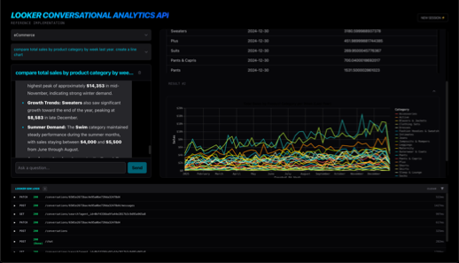

# Looker Conversational Analytics API Reference Demo



A reference implementation demonstrating how to use the Looker SDK to connect to [Conversational Analaytics in Looker](https://docs.cloud.google.com/looker/docs/conversational-analytics-overview).

## 🚀 Overview

This project provides a boilerplate for developers to build conversational data exploration interfaces. It showcases:

- **Natural Language Querying**: Direct interaction with data using natural language.
- **Dynamic Data Visualization**: Real-time rendering of charts (Vega-Lite) and tables.
- **Agent Selection**: Discovery and selection of data agents.
- **AI-First UX**: Streamlined transitions and visual feedback during CRUD operations.

---

## 🏗️ Architecture

### Component Hierarchy

- **Home (app/page.tsx)**: The main orchestrator managing the primary layout and API stream parsing.
  - **LoadingOverlay**: Global loading state during agent and session initialization.
  - **Chat Sidebar**:
    - `AgentSelector`: Handles agent discovery, sorting, and switching.
    - `ConversationSelector`: Manages the retrieval and selection of historical conversation sessions.
    - `ChatWindow`: Manages the conversational flow, input handling, and real-time message streaming.
    - `ErrorMessage`: Specialized display for API or networking failures with retry logic.
  - **Insight Workspace**:
    - `DataVisualization`: The primary rendering engine that dynamically switches between tabular and graphical views.
    - `VegaChart`: A specialized themed wrapper for Vega-Lite visualizations.
  - **LogDrawer**: A collapsible overlay providing real-time developer logs and raw API stream inspection.

### Data Flow (Streaming)

The application uses the **Looker SDK** to provide a responsive user experience:

1. User submits a message via the UI.
2. The application initiates the chat stream using `conversational_analytics_chat` via the Looker SDK.
3. The server-side route (Next.js API) manages the streaming connection to the Looker API.
4. The response is streamed back to the client as a `ReadableStream`.
5. The UI parses the stream, updating the `useChatStore` state in real-time.
6. After the stream concludes, `create_conversation_message` is called to persist the interaction history, ensuring context for future turns.

### State Management

Managed via **Zustand** (`src/store/useChatStore.ts`):

- **Messages**: A unified history of user and system messages (including "thoughts" and "payloads").
- **Agent Context**: Stores discovered agents and the currently selected agent ID.
- **Conversation State**: Tracks the `conversationId` and session-specific metadata.

---

## 📂 Project Structure

```text
src/
├── app/              # Next.js App Router (Pages & API Routes)
├── components/       # UI Components (React)
├── lib/              # Core Logic (Looker SDK interaction, Utilities)
├── store/            # State Management (Zustand)
└── test/             # Global Test Configuration
conductor/            # Spec-driven development framework artifacts
```

---

## ⚙️ Setup & Development

### Prerequisites

- Node.js 20+
- A Looker Instance (26.4+) with Conversational Analytics enabled.

### Installation

```bash
npm install
```

### Environment Configuration

Create a `.env` file in the root directory:

```env
LOOKER_CLIENT_ID=your_client_id
LOOKER_CLIENT_SECRET=your_client_secret
NEXT_PUBLIC_LOOKER_BASE_URL=https://your-instance.looker.com
NEXT_PUBLIC_DEFAULT_AGENT_ID=your_agent_id

# Optional: Enable User OAuth Mode
NEXT_PUBLIC_LOOKER_AUTH_MODE=env
# NEXT_PUBLIC_LOOKER_OAUTH_CLIENT_ID=ca-looker-sdk-demo
```

### Supported Auth Flows

The application supports two modes of authentication, managed via a global singleton SDK instance to ensure session stability:

1.  **Service Account (Default)**: Uses `LOOKER_CLIENT_ID` and `LOOKER_CLIENT_SECRET`. Set `NEXT_PUBLIC_LOOKER_AUTH_MODE=env`. All users interact with Looker via this single service account.
2.  **User OAuth**: Enabled by setting `NEXT_PUBLIC_LOOKER_AUTH_MODE=oauth`. Users must log in with their own Looker credentials via the OAuth 2.0 (PKCE) flow.

#### Registering for OAuth

If you want to use User OAuth mode, you must register the application in your Looker instance.

**Option 1: Using the provided script**
```bash
./scripts/register-oauth.sh https://your-instance.looker.com YOUR_ADMIN_API_TOKEN
```

**Option 2: Using the Looker API Explorer**
1. Navigate to your Looker instance's API Explorer.
2. Use the `register_oauth_client_app` method (API 4.0).
3. Set `client_guid` to `ca-looker-sdk-demo`.
4. Set `redirect_uri` to `http://localhost:3000/oauth/callback`.
5. Set `display_name` to `CA in Looker SDK Demo`.
6. Set `enabled` to `true`.

**IMPORTANT**: In both cases, you must also add your application's origin (e.g., `http://localhost:3000`) to the **Embedded Domain Allowlist** in **Admin > Platform > Embed**.

### Start Development Server

```bash
npm run dev
```

---

## 🧪 Testing

The project uses **Vitest** for unit and component testing.

### Run All Tests

```bash
npm test
```

### Watch Mode

```bash
npm run test:watch
```

---

## ⚠️ Technical Caveats

### Integration Path

This application communicates via the **Looker SDK** to the **[Looker API](https://docs.cloud.google.com/looker/docs/reference/looker-api/latest/methods/ConversationalAnalytics)**. It does **not** use the [GDA (geminidataanalytics.googleapis.com) API](https://docs.cloud.google.com/gemini/data-agents/reference/rest) directly. This ensures that all data access adheres to Looker's centralized governance and security model.

### SDK Support

This implementation uses the officially released **Looker SDK (26.4+)** which includes built-in methods for Conversational Analytics capabilities.

### Manual State Persistence

A key architectural difference between the **Looker Conversational Analytics API** and the **Gemini Data Analytics API** is the management of conversation state. While both APIs use chat with a conversation reference, the difference is:

- **GDA API**: Manages conversation state and history context automatically within the API backend.
- **Looker CA API**: Requires the developer to **persist** the message history after each full interaction turn (User Message + System Responses).

In this demo, the `persistLookerMessages()` function (found in `src/lib/looker-conversation.ts`) is called at the end of every successful chat stream. This function sends the complete interaction payload back to the Looker `/conversations/{id}/messages` endpoint. Failing to do this will result in the data agent "forgetting" the preceding conversation context in the next turn.

## Deployment

The project includes a `Dockerfile` for containerization. It builds the Next.js app.

The steps below will deploy the app the Cloud Run using Identity Aware Proxy (IAP) to require authentication.

### Convenience Script

For a streamlined deployment that automatically includes all environment variables from your `.env` file, you can use the provided `scripts/deploy.sh` script.

1. Ensure you have a `.env` file populated with your configuration.
2. Run the script:
   ```bash
   chmod +x scripts/deploy.sh
   ./scripts/deploy.sh
   ```
   This script parses your local `.env` file and deploys the application to Cloud Run with all environment variables set.

### Setup IAP

3. **Enable IAP on the Service**
   ```bash
   gcloud beta run services update looker-ca-reference-demo \
     --iap \
     --region us-central1
   ```
4. **Configure the "Gatekeeper" (IAM)**

   Make sure to replace 'your-domain.com' below:

   ```bash
   PROJECT_NUMBER=$(gcloud projects describe $(gcloud config get-value project) --format="value(projectNumber)")

   gcloud projects add-iam-policy-binding $(gcloud config get-value project) \
       --member="serviceAccount:service-${PROJECT_NUMBER}@gcp-sa-iap.iam.gserviceaccount.com" \
       --role="roles/run.invoker"

   gcloud beta iap web add-iam-policy-binding \
       --resource-type=cloud-run \
       --service=looker-ca-reference-demo \
       --region=us-central1 \
       --member='domain:your-domain.com' \
       --role='roles/iap.httpsResourceAccessor'
   ```
